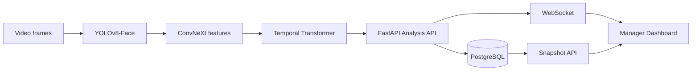

# PersonaLive

> AI-assisted deepfake detection and real-time decision support for online meetings.

PersonaLive is an end-to-end MVP developed for the **Huawei ICT Competition 2026–2027 — Innovation Track**. It analyzes facial video frames for visual manipulation indicators, converts model output into an interpretable reality score, and delivers the result to a meeting manager in real time.

The system is designed as a decision-support layer: **AI produces the analysis, the backend validates and distributes it, the interface presents the risk, and the final decision remains with the meeting manager.**

## Why PersonaLive?

Deepfake technology can enable convincing visual impersonation during remote meetings, interviews, and sensitive corporate communications. PersonaLive addresses this risk through a privacy-aware architecture that:

- detects and crops faces from sampled video frames;
- evaluates spatial and temporal manipulation patterns;
- reports authenticity-related scores in real time;
- preserves session state across reload and reconnect events;
- stores analysis metadata without persisting raw meeting video or audio;
- keeps human oversight at the center of every action.

## System Architecture



## AI Pipeline

1. **Face detection:** YOLOv8-Face detects and crops the facial region with a configurable margin.
2. **Feature extraction:** A pretrained ConvNeXt model produces a 768-dimensional feature vector for each sampled frame.
3. **Temporal modeling:** Twenty-frame sequences are evaluated by a two-layer, eight-head Temporal Transformer.
4. **Classification:** The model produces a real/fake prediction together with probability and confidence values.
5. **Integration:** Analysis metadata is sent to the PersonaLive backend and associated with the correct session and participant.

### Experimental Results

Results obtained on the FaceForensics++ C23 experimental test split:

| Metric | Value |
|---|---:|
| Accuracy | 97.47% |
| Macro F1 | 0.9195 |
| AUC | 0.9927 |

> These values represent controlled experimental results and should not be interpreted as guaranteed performance in every real-world environment.

## Core Capabilities

- Session lifecycle management: `waiting → active → ended`
- Participant creation, listing, and disconnection
- Validated AI analysis contract with timezone-aware timestamps
- Reality score calculation from the model's manipulation probability
- PostgreSQL persistence with SQLAlchemy 2
- Database migrations with Alembic
- Real-time analysis updates over WebSocket
- Snapshot-based state recovery after reload or reconnect
- Human-controlled removal of risky participants from the analysis flow
- Automated backend and frontend tests
- GitHub Actions continuous integration for backend changes

## Technology Stack

| Layer | Technologies |
|---|---|
| AI | Python, PyTorch, OpenCV, YOLOv8-Face, ConvNeXt, Temporal Transformer |
| Backend | FastAPI, Pydantic v2, SQLAlchemy 2, Alembic, Uvicorn |
| Database | PostgreSQL |
| Real-time communication | WebSocket, REST API, Snapshot API |
| Frontend | React 19, TypeScript, Vite, Zustand |
| Desktop runtime | Tauri 2, Rust |
| Testing and CI | Pytest, frontend unit tests, GitHub Actions |

## Repository Structure

```text
ICT-COMPETITION-2027/
├── FaceForensics++_C23.ipynb       # AI research and training workflow
├── fakesent-frontend/
│   ├── ai_core/                    # AI inference service and model assets
│   ├── src/                        # React and TypeScript application
│   └── src-tauri/                  # Tauri desktop runtime
└── personalive-backend/            # FastAPI, PostgreSQL and WebSocket services
```

The latest backend and frontend integration work is maintained in the following development branches until final consolidation into `main`:

- [`backend-gelistirme`](https://github.com/hilalariboga34/ICT-COMPETITION-2027/tree/backend-gelistirme)
- [`frontend-gelistirme`](https://github.com/hilalariboga34/ICT-COMPETITION-2027/tree/frontend-gelistirme)

## Analysis API Contract

```http
POST /api/v1/analysis/evaluate
Content-Type: application/json
```

```json
{
  "sessionId": "11111111-1111-4111-8111-111111111111",
  "participantId": "22222222-2222-4222-8222-222222222222",
  "fakeProbability": 0.25,
  "confidence": 0.90,
  "timestamp": "2026-09-09T12:30:00Z",
  "modelVersion": "temporal-transformer-v1"
}
```

The backend calculates:

```text
realityScore = 1.0 - fakeProbability
```

The validated result is committed to PostgreSQL before being broadcast to clients connected to the matching session channel.

## Local Development

### Prerequisites

- Python 3.12
- Node.js and npm
- PostgreSQL
- Git LFS
- Rust toolchain for the optional Tauri desktop runtime

### 1. Clone the repository and download model assets

```bash
git clone https://github.com/hilalariboga34/ICT-COMPETITION-2027.git
cd ICT-COMPETITION-2027
git lfs pull
```

### 2. Backend

Use the backend documentation for environment configuration, migrations, API startup, and tests:

- [`personalive-backend/README.md`](https://github.com/hilalariboga34/ICT-COMPETITION-2027/blob/backend-gelistirme/personalive-backend/README.md)
- [`personalive-backend/DATABASE.md`](https://github.com/hilalariboga34/ICT-COMPETITION-2027/blob/backend-gelistirme/personalive-backend/DATABASE.md)
- [`personalive-backend/AI_INTEGRATION.md`](https://github.com/hilalariboga34/ICT-COMPETITION-2027/blob/backend-gelistirme/personalive-backend/AI_INTEGRATION.md)

### 3. Frontend

```bash
cd fakesent-frontend
npm install
npm run dev -- --host 127.0.0.1 --port 5173
```

The frontend reads REST and WebSocket endpoints from environment variables. See `fakesent-frontend/.env.example` in the frontend development branch.

### 4. AI Core

The AI model weights are managed with Git LFS. The inference service requires its Python dependencies and compatible model paths to be configured before startup.

> The final AI-to-backend runtime connection is currently being consolidated and validated. Do not treat the AI service as production-ready until this integration is complete.

## Privacy by Design

- PersonaLive does not analyze or store meeting audio.
- Raw video and extracted frames are not persisted by the backend.
- Frames required for inference are intended to be processed temporarily in memory.
- Runtime storage is limited to session, participant, timestamp, model version, confidence, score, and status metadata.
- The system performs manipulation analysis, not facial identity recognition.
- Automated results support the manager's decision; they do not independently determine sanctions or access rights.

## Project Status

| Component | Status |
|---|---|
| AI training and experimental evaluation | Completed |
| Model assets tracked with Git LFS | Completed |
| FastAPI analysis and session services | Completed on development branch |
| PostgreSQL persistence and migrations | Completed on development branch |
| WebSocket live updates | Completed on development branch |
| Snapshot and reconnect synchronization | Completed on development branch |
| AI inference → backend contract integration | In progress |
| Authentication and authorization | Planned |
| Production deployment and distributed messaging | Planned |

## Team

| Team Member | Responsibility |
|---|---|
| Hilal Gül Arıboğa | Team Lead and Backend Developer |
| Sedat | AI Developer |
| Yusuf | Frontend Developer |
| Berkant | Database and Infrastructure Developer |

## Scope and Disclaimer

PersonaLive is a competition and research MVP. It is not an official Huawei product, does not claim an official integration with a commercial conferencing platform, and must not be used as the sole basis for decisions affecting an individual.

## License

No open-source license has been declared yet. All rights are reserved by the project team unless stated otherwise.
